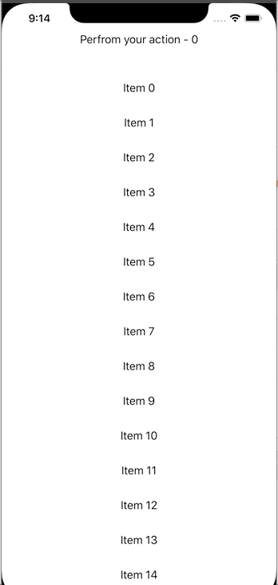

# TrackableList

Add the ability for the List in SwiftUI to perform an action when scrolling to last.



## Platform support
- iOS
- macOS

## Installation
In your project, go to File -> Swift Packages -> Add Package Dependency. Copy and paste the url below into the search box
https://github.com/phuhuynh2411/TrackableList.git

## Basic Usage
```swift
TrackableList(onLast: {
    print("perfrom an action here.")
}) {
    ForEach(0..<100) { index in
        Text("Item \(index)")
        .padding()
    }
}
```

